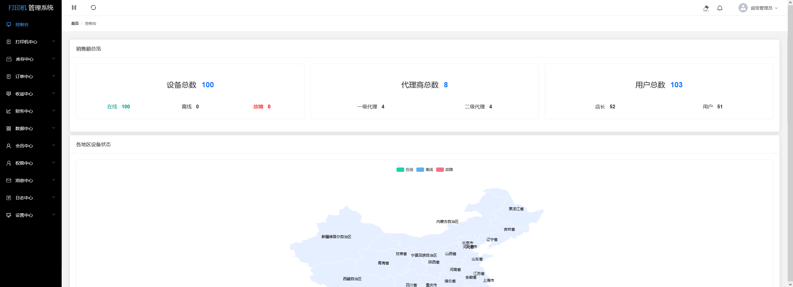

## Online share printer organization platform(在线共享打印机机构平台端)
- Cooperate with the community door shop to provide online scanning code and remote printing.
- 与小区门口商店合作，提供在线扫码，远程打印。

## Technology use
- Development language：Vue 2.0

## Picture display

### Find for remote work or collaboration
I have accumulated 12 years of experience in PHP development, 5 years of dedicated full-time outsourcing service experience, and 3 years of expertise in Python development. I am currently exploring part-time, remote work opportunities. Should you find that my background aligns with your requirements, I would appreciate the opportunity to discuss potential collaboration.

### 寻找远程工作或者合作
我是一位12年PHP开发经验，5年全职外包服务经验，3年python开发经验。现在寻找兼职工作、远程工作、驻场工作机会。 感觉合适的话随时联系。

### Contact way
- Email: 1326336909@qq.com
- Wechat: zxf5115
